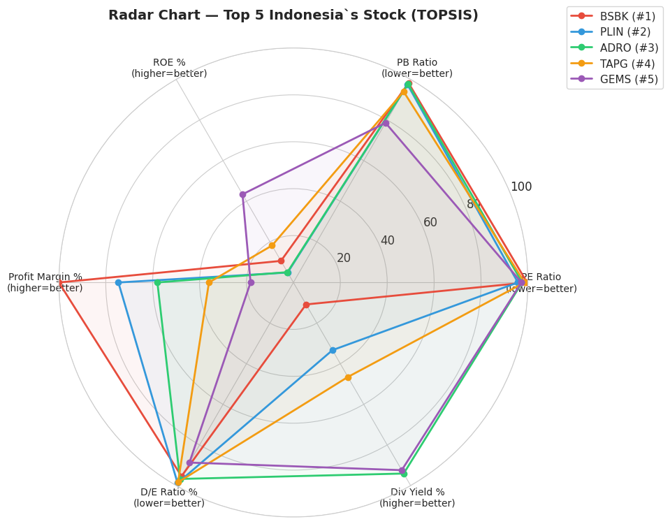

# 📈 IDX Stock Analysis: Beyond the PE Ratio Trap

[]

> **"Low PE Ratio = cheap stock = buy."**
> 
> Itu adalah asumsi umum bagi investor pemula. Proyek ini membuktikan bahwa mengevaluasi saham hanya dari satu metrik bisa sangat menjebak. Menggunakan data 950+ saham dari Bursa Efek Indonesia, saya menerapkan metode pengambilan keputusan multi-kriteria untuk menemukan "hidden gem" yang sebenarnya.

---

## Overview
Proyek ini menjawab tantangan evaluasi saham holistik dengan menggunakan **MCDA (Multi-Criteria Decision Analysis)**. Alih-alih hanya melihat harga murah (PE Ratio), kita membedah kualitas, keamanan aset, dan bagi hasil secara simultan.

## Methodology
1.  **Dimensions & Criteria:**
    * **Value:** PE Ratio, PB Ratio
    * **Quality:** ROE (%), Profit Margin (%)
    * **Safety:** Debt to Equity Ratio (%)
    * **Income:** Dividend Yield (%)
2.  **Weighting:** Menggunakan **Entropy Method** untuk menentukan bobot kriteria secara objektif berdasarkan variansi data.
3.  **Ranking:** Menggunakan **TOPSIS** (*Technique for Order of Preference by Similarity to Ideal Solution*).

---

## Visualizing the Top 5
Berikut adalah profil dari 5 saham teratas berdasarkan skor TOPSIS. Semakin luas area radar, semakin solid performa saham tersebut di berbagai dimensi keuangan.

---

## Key Results: TOPSIS vs Naive PE-Only
Perbandingan antara Top 20 Saham versi TOPSIS dengan Top 20 Saham yang hanya dipilih berdasarkan PE Ratio terendah:

| Metric | TOPSIS Selection | PE-Only Selection |
| :--- | :---: | :---: |
| **Avg. ROE** | **27.3%** | 21.6% |
| **Avg. Profit Margin** | **32.7%** | 19.0% |
| **Avg. Debt/Equity** | **10.6%** | 62.1% |
| **Avg. Div Yield** | **8.0%** | 6.7% |

**Insight:** Portofolio hasil TOPSIS terbukti jauh lebih sehat dengan tingkat hutang yang **6x lebih rendah** dan profitabilitas yang lebih tinggi.

---

## 📂 Project Structure
* `idx-stock-topsis-analysis/`
    * `Indonesia's_Stock_Analysis_Gisella_Firlianda.ipynb` (Main Analysis)
    * `05_radar_top5.png` (Visualization)
    * `LICENSE` (MIT License)

## ⚠️ Disclaimer
Proyek ini dibuat untuk tujuan edukasi dan portofolio data analisis, bukan merupakan saran investasi.

---
**Contact:** [Gisella Firlianda](https://github.com/gisellafrlnd)
